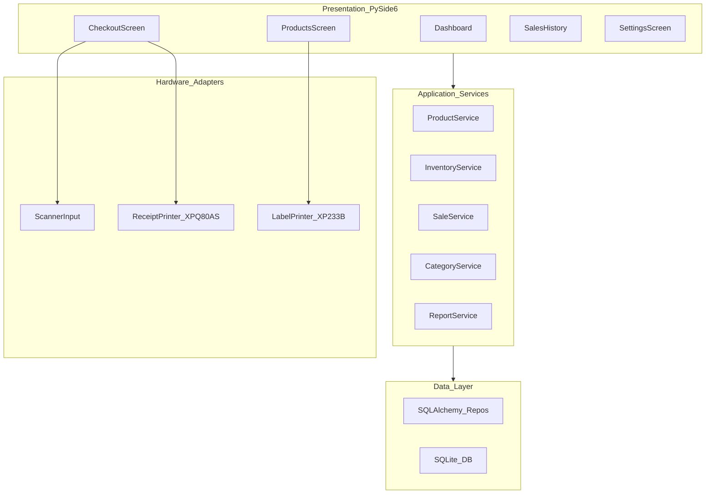
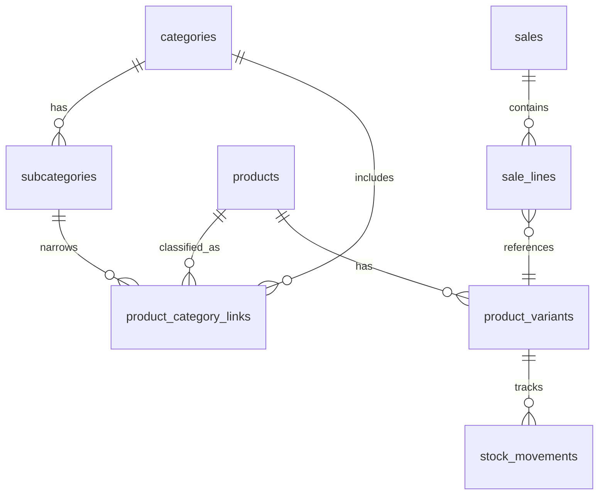
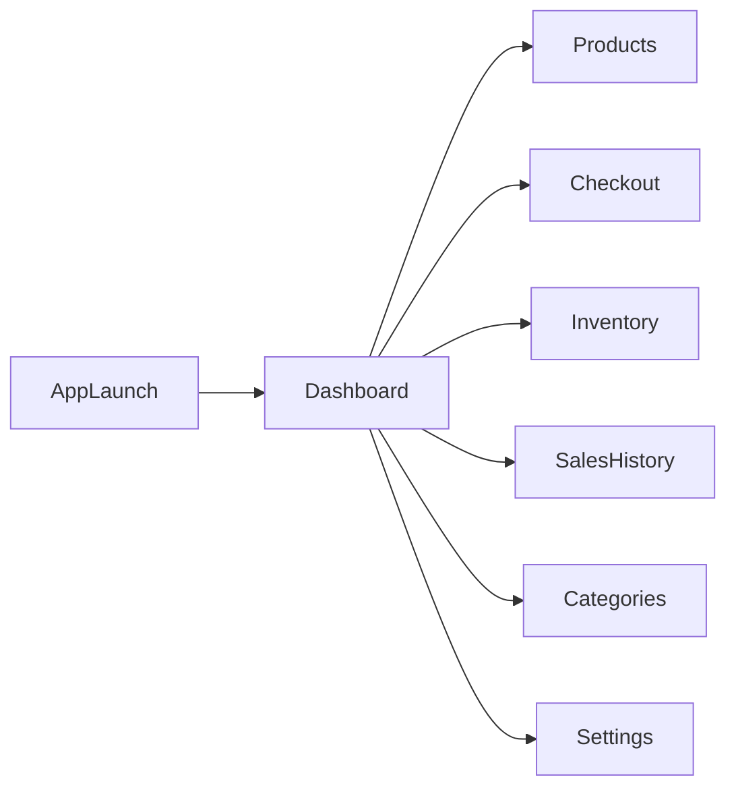

# Sandy Cashier — Store System Plan

## What you are building

A **single Windows desktop app** that covers:

1. **Inventory** — add/edit products, categories, stock levels, print barcode labels
2. **Checkout** — scan barcodes, sell items, print receipts, auto-deduct stock
3. **Reporting** — what sold, what is low/out of stock, daily totals

**Access model:** one cashier uses the system on one PC. **No login, no roles** — app opens straight to the dashboard.

**Returns/refunds:** **out of scope.** The client has no return or refund policy. Do not build a Returns screen, refund receipts, or restock-on-return. Sales are final. Stock corrections happen only via Inventory (restock / adjustment).

Your client has:

- **Receipt printer:** Xprinter **XP-Q80AS** (80mm thermal, ESC/POS)
- **Label printer:** Xprinter **XP-233B** (2-inch / ~58mm thermal labels, TSPL)
- You will also need a **USB barcode scanner** at checkout (HID keyboard — no special driver)

---

## Recommended architecture

### Pattern: layered desktop monolith



**Why this (not web, not microservices):**

- `.exe` on Windows → Python 3.11+ / **PySide6** + **PyInstaller**
- Easy CRUD + search → local SQLAlchemy queries
- Single till today → **SQLite** file on disk
- Future branches → repository interfaces + `store_id` column now
- Clean UI → one shared stylesheet

**What to borrow from your references:**

- [SaleFlex.PyPOS](https://github.com/SaleFlex/SaleFlex.PyPOS) — folder layout, SQLAlchemy models, sale + inventory flow
- [CIM](https://github.com/Sekiro19/CIM) — table filtering, sorting, colored low-stock rows
- [PocketBiz](https://github.com/neesarg123/PocketBiz) — simple checkout UX (Excel import later in Phase 2; no sample list today)
- [Simple Inventory](https://github.com/ryanthackston/Simple-Inventory-Management-System-by-Barcode-Scanner) — scan-to-cart
- [BarcodePOS](https://github.com/BeratARPA/BarcodePOS) — printer integration patterns (C#; conceptual)

**Tech stack:**

- **Language:** Python 3.11+
- **UI:** PySide6
- **DB:** SQLite + SQLAlchemy 2.x
- **Money:** Egyptian Pound (**EGP**), 2 decimal places, **no tax / VAT**
- **Barcode generation:** `python-barcode` + Pillow
- **Receipts:** `python-escpos` targeting XP-Q80AS (USB)
- **Labels:** TSPL commands (or Windows spooler via vendor driver) targeting XP-233B
- **Packaging:** PyInstaller `--onedir` → `SandyCashier.exe`
- **Reports/export:** `openpyxl` (Phase 2)

---

## Is Python the right choice?

**Yes.** Same class of app as SaleFlex.PyPOS and CIM. These Xprinter models speak standard ESC/POS and TSPL, which Python handles well. C# is not needed for v1.

---

## How to categorize and sub-categorize

Two-level hierarchy (Category → optional Subcategory) plus **many-to-many** product links.



**Rules:**

1. A product can belong to **multiple** category/subcategory pairs.
2. At least **one** classification is required; one link is **primary** (`is_primary`) for display and receipts.
3. Subcategory is optional on each link.
4. Price and stock live on **variants**. Simple items get one auto-created variant.
5. No 3+ level trees in v1.

**UI:** multi-select category rows with primary marker; filter OR by category; search name / SKU / barcode; primary category + “+N more” in tables.

---

## Core data model (v1)

- `categories` — id, name, sort_order, is_active
- `subcategories` — id, category_id, name, sort_order
- `products` — id, name, description, is_active, **store_id** (default 1)
- `product_category_links` — product_id, category_id, subcategory_id (nullable), **is_primary**, unique (product_id, category_id, subcategory_id)
- `product_variants` — product_id, sku, barcode (unique), price (EGP), cost (EGP), stock_qty, reorder_level, attributes_json
- `stock_movements` — variant_id, qty_change, reason (`sale`, `restock`, `adjustment`), reference_id, created_at
- `sales` — total (EGP), payment_method, created_at, **store_id**
- `sale_lines` — sale_id, variant_id, qty, unit_price, line_total
- `settings` — key/value:
   - `store_name` = `fyonka` (temporary)
   - `store_address` = `baltim` (temporary)
   - `store_phone` = `01201538851` (temporary)
   - `currency` = `EGP`
   - `tax_rate` = `0`
   - receipt/label printer device names

**Stock rule:** never edit `stock_qty` in isolation — always insert a `stock_movement` and update quantity in one transaction.

**Money rule:** display as `EGP 12.50` (or `١٢٫٥٠ ج.م.` later if Arabic UI is requested — v1 can stay Latin numerals). No tax line on receipts.

---

## App screens



| Screen            | Purpose                                                       | UX                                            |
| ----------------- | ------------------------------------------------------------- | --------------------------------------------- |
| **Dashboard**     | Today’s sales total (EGP), transaction count, low-stock count | Shortcuts to Checkout                         |
| **Products**      | CRUD + variants + multi-category + print label                | Split list/form; category chips               |
| **Categories**    | CRUD categories/subcategories                                 | Warn if products still linked                 |
| **Inventory**     | Restock, adjust, movement history                             | Low-stock colors; category filter             |
| **Checkout**      | Scan → cart → pay cash → XP-Q80AS receipt                     | Barcode field always focused; large EGP total |
| **Sales history** | Past receipts, filter date/product/category                   | View / reprint receipt only (no Start Return) |
| **Settings**      | Store header (editable temps), printers, backup               | Test Print for both printers                  |

**Usability:** one primary action per screen; confirm deletes; no login; persistent nav; keyboard-first checkout.

---

## Hardware integration (locked)

| Device  | Model                            | Approach                                                                                                                                                                     |
| ------- | -------------------------------- | ---------------------------------------------------------------------------------------------------------------------------------------------------------------------------- |
| Receipt | **Xprinter XP-Q80AS**            | 80mm thermal, **ESC/POS**. USB (Bluetooth/WiFi variants exist — default USB). Use `python-escpos`. Auto-cut after receipt.                                                   |
| Label   | **Xprinter XP-233B**             | ~2 inch / 20–60mm labels, 203 DPI, **TSPL** in label mode. USB. Print name + barcode (Code128) + price in EGP. Fallback: Windows driver + print bitmap if raw TSPL is flaky. |
| Scanner | USB HID (client still needs one) | Focus barcode input; Enter → lookup variant                                                                                                                                  |

**Receipt layout (v1):**

```
        fyonka
        baltim
     01201538851
------------------------
  item          qty  EGP
  ...
------------------------
  TOTAL              EGP
  Cash
  Thank you
```

Header fields come from Settings so the temporary name/address/phone can be changed without a rebuild.

**Label layout (v1):** product name (truncated), barcode, price in EGP. Keep it simple for 2-inch stock.

**Settings:** pick Windows printer name or USB VID/PID; **Test Print** for each device.

---

## Project structure

Greenfield in [Sandy_Cashier](d:\0_code\Sandy_Cashier):

```
Sandy_Cashier/
├── main.py
├── requirements.txt
├── build.spec
├── data/sandy_cashier.db
├── app/ui, services, repositories, models, hardware, utils
└── assets/
```

---

## Build `.exe`

1. Develop with `python main.py`
2. PyInstaller `--onedir`
3. Zip the folder for the store PC (no Python install)
4. Backup: Settings → Export backup / Open data folder (`sandy_cashier.db`)

---

## Phased delivery

### Phase 1 — MVP

- Nav, no login
- Categories, products (variants + many-to-many categories), inventory
- Checkout (cash, EGP, no tax), XP-Q80AS receipt
- XP-233B label print from Products
- Sales history + reprint
- `.exe`

### Phase 2 — Polish

- Excel import/export (no sample list today — enter products in-app first)
- Low-stock dashboard alerts
- Daily summary (gross sales only)
- Optional card as **manual tender** (not a card terminal)

### Phase 3 — Branch-ready

- Wire `store_id`
- Central DB / sync when a second location is real

**Not planned:** returns, refunds, tax, multi-user login.

---

## Key decisions locked in

| Decision          | Choice                                                  |
| ----------------- | ------------------------------------------------------- |
| Language          | Python 3.11+ / PySide6 / PyInstaller                    |
| Architecture      | Layered desktop monolith                                |
| Database          | SQLite + `store_id` placeholder                         |
| Categories        | 2-level + many-to-many                                  |
| Products          | Parent + variants                                       |
| Currency          | **EGP**, 2 decimals                                     |
| Tax               | **None**                                                |
| Receipt header    | **fyonka / baltim / 01201538851** (Settings, temporary) |
| Receipt printer   | **XP-Q80AS**, ESC/POS, 80mm                             |
| Label printer     | **XP-233B**, TSPL, 2-inch                               |
| Access            | Single cashier, no login                                |
| Returns           | **None** — sales are final                              |
| Product seed data | **None** — cashier enters products in the app           |

---

## Success criteria

- [ ] Add/edit/delete product with one or more categories quickly
- [ ] Find any product by name or barcode quickly
- [ ] Complete a sale by scanning items and print an XP-Q80AS receipt (EGP, no tax, fyonka header)
- [ ] Print a barcode label on XP-233B
- [ ] Stock decreases after sale; restock/adjust only via Inventory
- [ ] No return/refund UI exists
- [ ] Filter inventory by category and low stock
- [ ] Runs as `.exe` without Python installed
- [ ] Database backup is obvious in Settings
